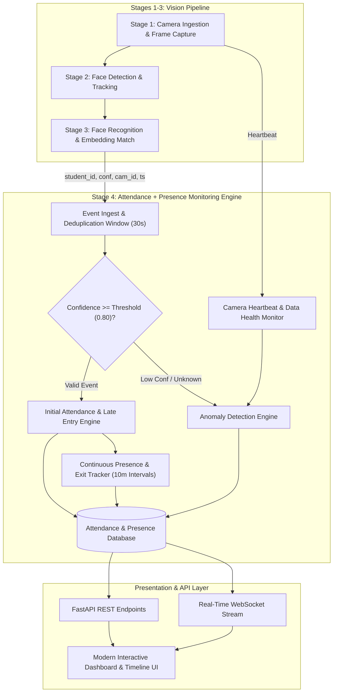

# Implementation Plan — Stage 4: Attendance + Presence Monitoring Engine

Develop and integrate **Stage 4: Attendance + Presence Monitoring Engine** for the AI Classroom Monitoring project. Stage 4 converts upstream face-recognition events (from Stages 1–3) into real-time attendance, presence tracking, late-entry detection, continuous presence verification, presence restoration, possible early-exit flagging, attendance percentages, anomalies, and camera health monitoring.

## User Review Required

> [!NOTE]
> The workspace is an empty root directory. We will construct a clean, modular repository layout that hosts the complete Stage 4 engine along with modular contracts/interfaces for Stages 1–3, a full FastAPI backend, SQLite/PostgreSQL database models with indexing, WebSocket & REST APIs, comprehensive pytest test suite, and a modern React (Vite) real-time dashboard.

## Proposed Architecture & Components



---

## Detailed Plan

### 1. Backend & Engine Architecture (`backend/app/`)
- **Configuration (`backend/app/config.py`)**:
  - `late_threshold_minutes` (default 5)
  - `verification_interval_minutes` (default 10)
  - `absence_confirmation_intervals` (default 3)
  - `recognition_deduplication_seconds` (default 30)
  - `confidence_threshold` (default 0.80)
  - `camera_timeout_seconds` (default 60)
  - `attendance_good_threshold` (75%), `attendance_warning_threshold` (65%)
  - Configurable via `.env` and runtime API.
- **Database Models (`backend/app/models/`)**:
  - `Student`: id, student_id, name, class_id, email, active
  - `ClassPeriod`: id, class_id, period_id, subject, start_time, end_time, date
  - `AttendanceSession`: student_id, student_name, class_id, period_id, date, camera_id, class_start_time, class_end_time, first_detected_at, last_detected_at, attendance_status, entry_status, late_minutes, presence_status, presence_intervals, missed_intervals, presence_restored, possible_exit, confidence, created_at, updated_at
  - `PresenceEvent`: id, session_id, student_id, class_id, period_id, timestamp, event_type (`FIRST_DETECTION`, `PRESENCE_VERIFIED`, `PRESENCE_UNVERIFIED`, `PRESENCE_RESTORED`, `POSSIBLE_EARLY_EXIT`), camera_id, interval_index, details
  - `AttendanceAnomaly`: event_id, event_type (`UNKNOWN_FACE`, `LOW_CONFIDENCE`, `DUPLICATE_RECOGNITION`, `PRESENCE_MISSING`, `LATE_ENTRY`, `POSSIBLE_EARLY_EXIT`, `CAMERA_OFFLINE`, `MISSING_RECOGNITION_DATA`), student_id, class_id, period_id, camera_id, timestamp, confidence, severity (`LOW`, `MEDIUM`, `HIGH`, `CRITICAL`), description, resolved
  - `CameraStatus`: camera_id, name, location, last_heartbeat, status (`ONLINE`, `OFFLINE`, `DEGRADED`), last_frame_processed_at
  - Indexed on `student_id`, `class_id`, `period_id`, `date`, `camera_id`, `timestamp`.
- **Core Stage 4 Services (`backend/app/stage4/`)**:
  - `AttendanceEngine`: Evaluates first detection, calculates late minutes against class schedule, ensures no duplicate attendance creation.
  - `PresenceTracker`: Manages timeline intervals, flags `PRESENCE_UNVERIFIED`, calculates unverified duration upon `PRESENCE_RESTORED`, and flags `POSSIBLE_EARLY_EXIT` / `PRESENCE_EXCEPTION` safely when missed intervals reach threshold.
  - `DeduplicationService`: Sliding window cache to discard multiple recognitions within deduplication seconds.
  - `AnomalyDetector`: Inspects events for low confidence, unknown faces, late entries, presence missing, possible early exits, and camera anomalies.
  - `CameraHealthService`: Tracks camera heartbeats and triggers `CAMERA_OFFLINE` / `MISSING_RECOGNITION_DATA` anomalies without falsely penalizing student attendance.
  - `MetricsCalculator`: Calculates `(Present Days / Working Days) * 100` and classifies into `GOOD`, `WARNING`, `CRITICAL`.
- **API Endpoints (`backend/app/routes/`)**:
  - `POST /api/attendance/event`: Ingest Stage 1–3 detection event
  - `POST /api/attendance/verify-presence`: Trigger interval verification
  - `POST /api/attendance/camera/heartbeat`: Ingest camera status
  - `GET /api/attendance/student/{student_id}`: Get student record
  - `GET /api/attendance/class/{class_id}`: Get class attendance
  - `GET /api/attendance/date/{date}`: Query by date
  - `GET /api/attendance/summary`: Dashboard KPIs and stats
  - `GET /api/attendance/anomalies`: List anomalies (with filtering)
  - `PATCH /api/attendance/anomalies/{id}/resolve`: Mark anomaly resolved
  - `GET /api/attendance/student/{student_id}/timeline`: Student presence timeline
  - `GET /api/attendance/student/{student_id}/percentage`: Attendance % calculation
  - `GET /api/attendance/camera/status`: Camera statuses
  - `GET/PUT /api/attendance/config`: Live dynamic configuration
  - `WebSocket /ws/attendance`: Real-time event and presence update broadcaster.
- **Stage 1–3 Pipeline Interfaces (`backend/app/stages_pipeline/`)**:
  - Clean modular abstract contracts and event schemas representing Stage 1 (Camera Ingestion), Stage 2 (Face Detection/Tracking), Stage 3 (Face Recognition), and an interactive Simulator to emit test events.

### 2. Frontend Real-time Dashboard (`frontend/`)
- **Tech**: React 18, Vite, Lucide-react, Vanilla CSS / Tailwind modern glassmorphism dark theme.
- **Components**:
  - **KPI Header**: Total Students, Present, Late, Presence Unverified, Possible Exit, Unknown Faces, Camera Status, Attendance Percentage.
  - **Live Recognition Feed & Simulator**: Emulate or view live Stage 1-3 detection events with timestamp, face preview badge, confidence, and action.
  - **Classroom Attendance Table**: Searchable, filterable student list displaying Student, ID, Entry, Attendance Status, Presence Status, Last Seen, and Alerts.
  - **Student Presence Timeline Drawer / Modal**: Rich visual step timeline with badges (`PRESENT`, `LATE`, `UNVERIFIED`, `RESTORED`, `POSSIBLE EXIT`).
  - **Anomaly Management Center**: Real-time anomaly feed with severity pills and instant "Resolve" action.
  - **Camera Health Bar**: Real-time camera uptime indicator with last heartbeat.
  - **Configuration Drawer**: Slider/input controls for live threshold tweaks.

### 3. Automated Test Suite (`tests/`)
Comprehensive pytest suite covering all 12+ required test scenarios:
1. `test_student_detected_at_class_start` (On-time -> PRESENT)
2. `test_student_detected_late` (Detection > threshold -> LATE with exact late_minutes)
3. `test_duplicate_recognition` (Multiple detections within deduplication window handled as one)
4. `test_low_confidence_recognition` (Confidence < threshold -> anomaly logged, attendance not marked)
5. `test_one_missed_verification` (Temporary missing -> PRESENCE_UNVERIFIED, not absent)
6. `test_multiple_missed_verifications` (Consecutive missed -> PRESENCE_EXCEPTION, possible_exit = true)
7. `test_presence_restored` (Unverified -> detected -> PRESENCE_RESTORED with previous_unverified_duration)
8. `test_possible_early_exit_safe_terminology` (Ensures safe wording, never "definitely left")
9. `test_camera_offline` (Camera failure -> CAMERA_OFFLINE anomaly, students not marked absent)
10. `test_unknown_face` (Unknown face -> UNKNOWN_FACE anomaly)
11. `test_attendance_percentage_calculation` ((Present / Working) * 100 on finalized sessions)
12. `test_attendance_threshold_classification` (>= 75% GOOD, 65-74% WARNING, < 65% CRITICAL)

---

## Verification Plan

### Automated Tests
Run pytest in `backend`:
```powershell
python -m pytest tests/ -v
```

### Manual & End-to-End Verification
1. Start backend: `python -m uvicorn app.main:app --port 8000`
2. Start frontend: `npm.cmd run dev`
3. Launch browser subagent / interact with the dashboard:
   - Ingest on-time face event -> verify instant `PRESENT` & `ON_TIME` badge
   - Ingest late face event (e.g. 09:22) -> verify `LATE (22m)`
   - Ingest duplicate events -> verify deduplication
   - Trigger missed intervals -> verify `PRESENCE_UNVERIFIED` and `POSSIBLE EARLY EXIT`
   - Trigger redetection -> verify `PRESENCE_RESTORED`
   - Test camera offline trigger -> verify `CAMERA_OFFLINE` anomaly without falsely marking students absent
   - Open student drawer -> verify timeline visual badges.
